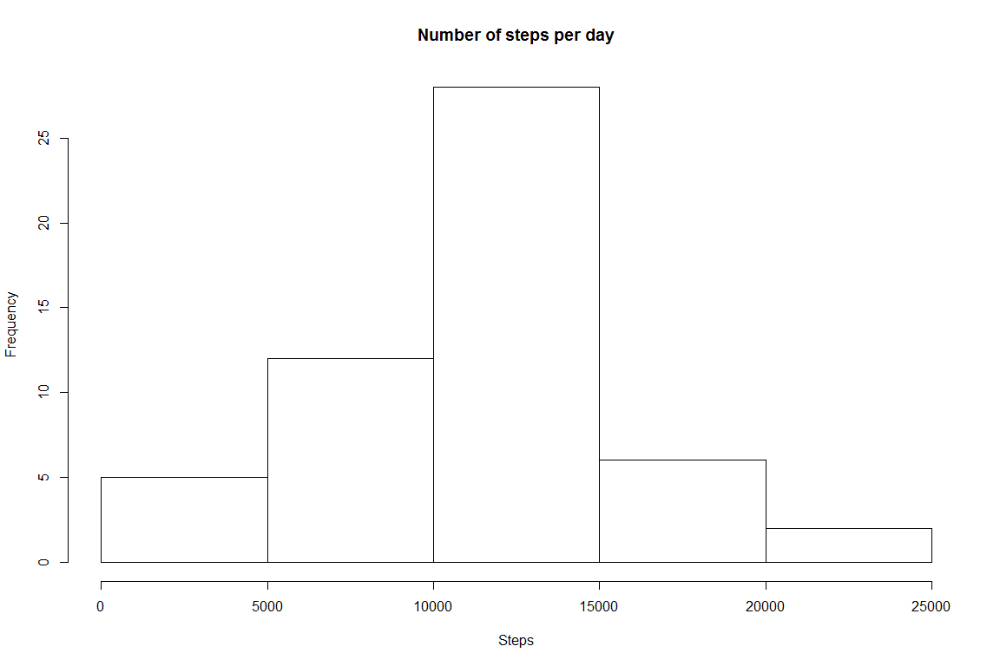
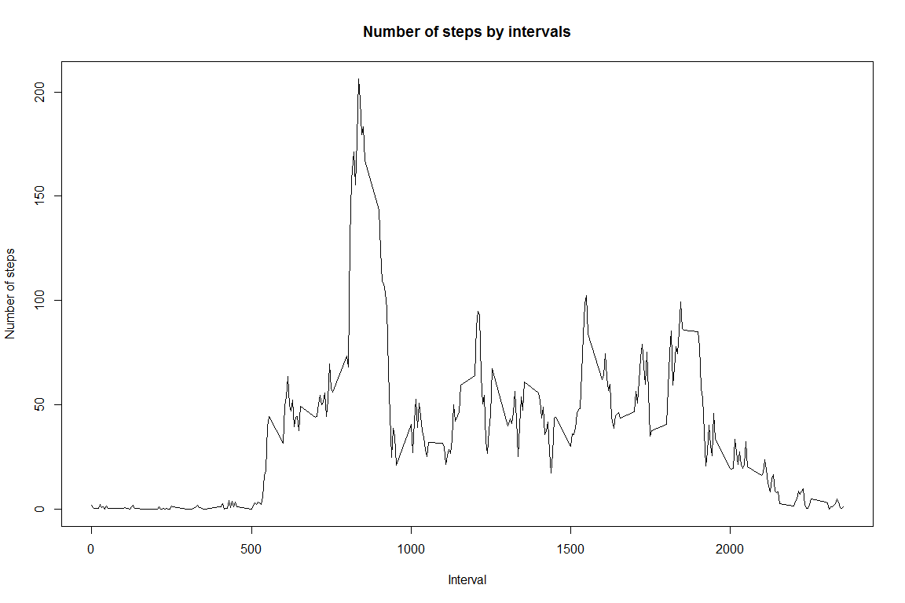
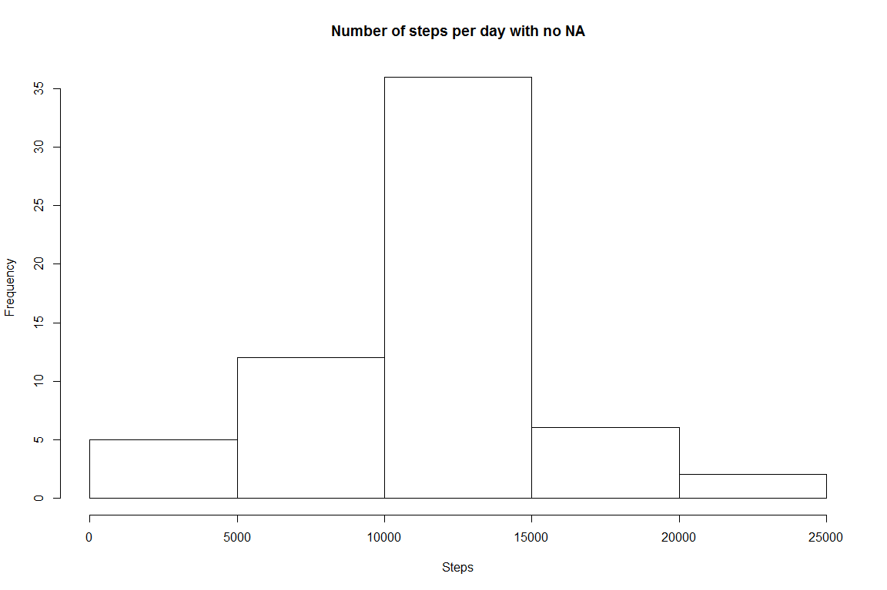
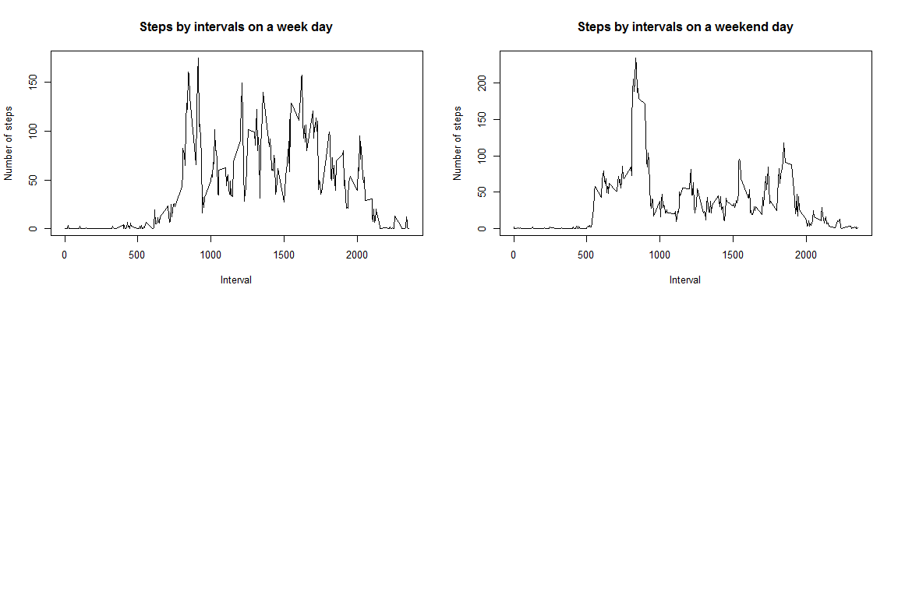

# Course Project 1


```r
knitr::opts_chunk$set(echo = TRUE)
library(knitr)
library(rmarkdown)
library(dplyr)
```

```
## 
## Attaching package: 'dplyr'
```

```
## The following objects are masked from 'package:stats':
## 
##     filter, lag
```

```
## The following objects are masked from 'package:base':
## 
##     intersect, setdiff, setequal, union
```

```r
library(ggplot2)
```

Reading the dataset from CSV file


```r
activityData <- read.csv("activity.csv")
```

Histogram of the total number of steps taken each day


```r
hist(aggregate(steps~date,activityData,sum)$steps,main="Number of steps per day",xlab = "Steps")
```

<!-- -->

Mean and median number of steps taken each day


```r
stepsMean <- as.character(mean(aggregate(steps~date,activityData,sum)$steps))
stepsMedian <- median(aggregate(steps~date,activityData,sum)$steps)
```

The mean is 10766.1886792453 the median is 10765

___________________________________
Average number of steps taken by interval


```r
stepsByInterval <- aggregate(steps~interval,activityData,mean)
plot(stepsByInterval$interval,stepsByInterval$steps,type="l",main="Number of steps by intervals",xlab = "Interval" , ylab = "Number of steps")
```

<!-- -->

```r
maxStepsTime <- stepsByInterval[which.max(stepsByInterval$steps),1]
```

Maximum number of steps is at 835

___________________________________
imputing missing data 

We will use the mean of the the same interval for the missing data

```r
totalNa <- sum(is.na(activityData[1]))
newActivityData <- activityData
for(i in 1:nrow(newActivityData)) {
    if (is.na(newActivityData[i,1])){
        newActivityData[i,1] <- stepsByInterval[which( stepsByInterval[,1] %in%  newActivityData[i,3]),2]
        }  
}

hist(aggregate(steps~date,newActivityData,sum)$steps,main="Number of steps per day with no NA",xlab = "Steps")
```

<!-- -->

```r
stepsMeanNew <- as.character(mean(aggregate(steps~date,newActivityData,sum)$steps))
stepsMedianNew <- median(aggregate(steps~date,newActivityData,sum)$steps)
```


The mean of the data with no NA's is 10766.1886792453 the median is 1.0766189\times 10^{4} 

We dont see big change in the histogram and of course beacuse we used the mean for the intervals and if some interval is missing the all day is mssing, we dont see change in the median and the mean.

___________________________________


```r
library('dplyr')
activityData <- mutate(activityData,isWeekEnd=weekdays(as.Date(as.character(activityData$date)))  %in% c('Saturday','Sunday'))

stepsByIntervalWeekday <- aggregate(steps~interval,activityData[activityData[,4],],mean)
stepsByIntervalWeekend <- aggregate(steps~interval,activityData[!activityData[,4],],mean)
par(mfrow=c(2,2)) 
plot(stepsByInterval$interval,stepsByIntervalWeekday$steps,type="l",ylab = "Number of steps",main="Steps by intervals on a week day",xlab = "Interval")
plot(stepsByInterval$interval,stepsByIntervalWeekend$steps,type="l",ylab = "Number of steps",main="Steps by intervals on a weekend day",xlab = "Interval")
```

<!-- -->


